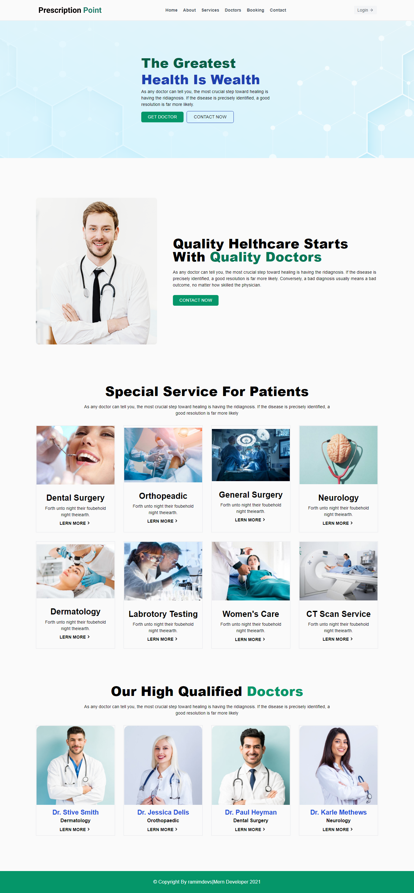

# Prescripition-Point | Health Care

Project Preview : <a href ="https://prescription-point.web.app/">Live Preview</a>

  
<h3>Features</h3>
<ul>
  <li>Using Json Data</li>
  <li>Using Private Route</li>
  <li>Dynamically services details show</li>
  <li>You can book the services</li>
  <li>User Authentication</li>
</ul>

<h3> Technology I have used.. </h3>
<ul>
  <li>ES6</li>
  <li>React JS</li>
  <li>React Router</li>
  <li>Firebase</li>
  <li>Tailwind CSS</li>
</ul>

<h3>Screenshot</h3>
  
  
  

  
